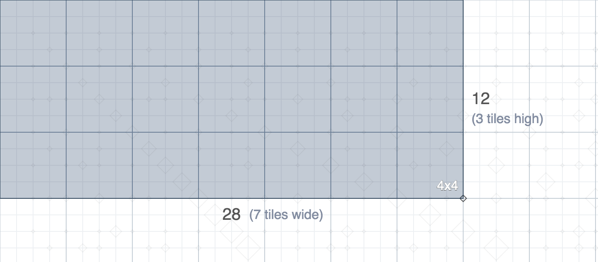
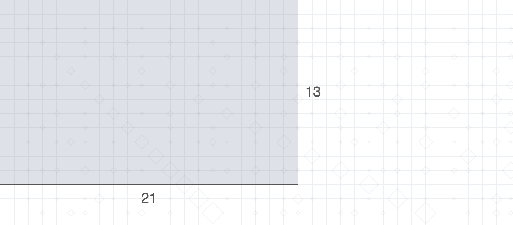
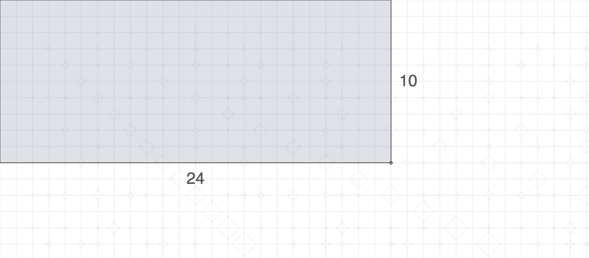
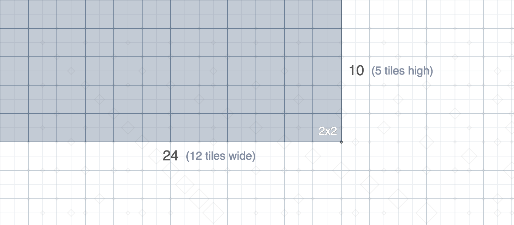

# Ratios

__[Try it here!](http://shaunlebron.github.io/ratios)__

A visual way to relate two numbers.

Years ago, this was the light-bulb example that made really _feel_ the nature of
numbers as magnitudes expressed in terms of other magnitudes (units).

_inspired by [Numbers at play] by Khan Academy_

[Numbers at play]:https://www.khanacademy.org/research/reports/cantor
[Euclidean algorithm]:https://en.wikipedia.org/wiki/Euclidean_algorithm

## Summary

Drag any rectangle to see it tiled with the largest possible squares.

For example, we can see below that 12 and 38 are most simplified when measured
in units of 4 (i.e. tiles of size 4x4).

## How it works

The [algorithm][Euclidean algorithm] inserts the largest possible squares until
everything is filled. The final square inserted is the simplest possible unit.

For example, the final square is shown in red below, meaning 13 and 21 cannot be simplified.

In the example below, the final square is shown in green, meaning 10 and 24 _can_ be simplified.

## Conclusions

Although the animations are stiff and wonky right now due to limited project
time, this outline represents an interesting visual method for understanding how
two numbers are related.  It seems to translate well to an understanding of
fractions, greatest common divisors, and perhaps others.
